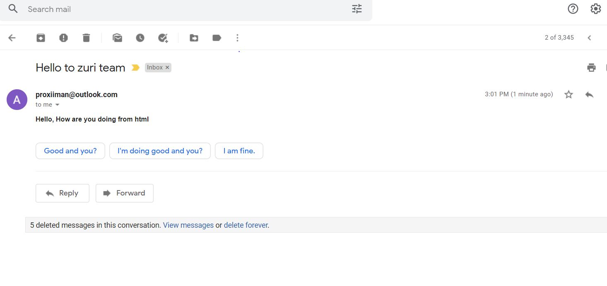
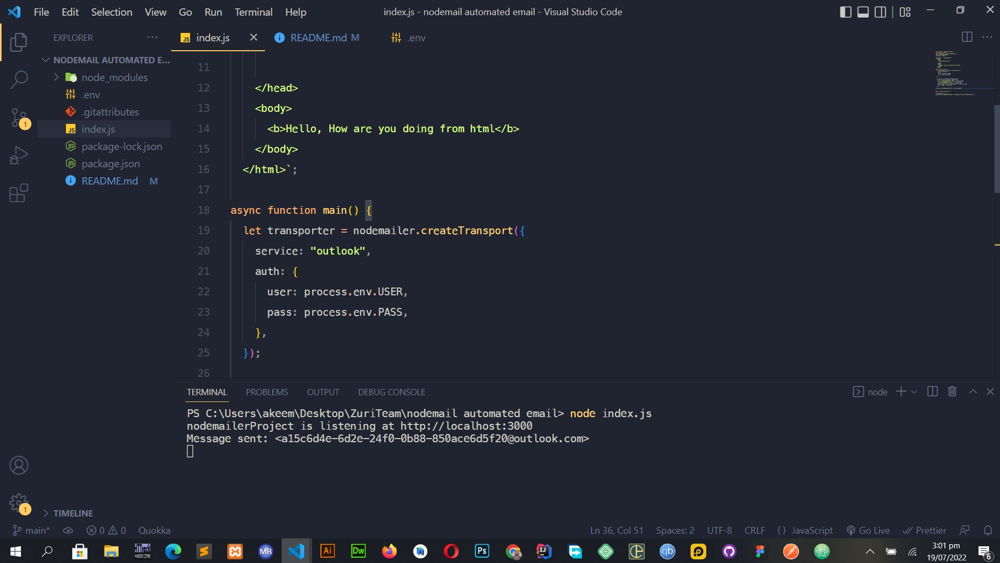

# nodemail-automated-email

# Project description

To send automated emails from my app

Set the environment variable below

## Environment Variables

To run this project, you will need to add the following environment variables to your .env file

`USER`

`PASS`

Run the app with node index.js

## Screenshot of email sent and receive

